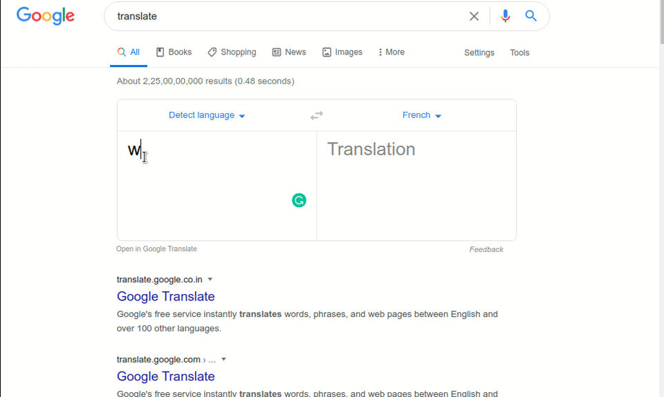
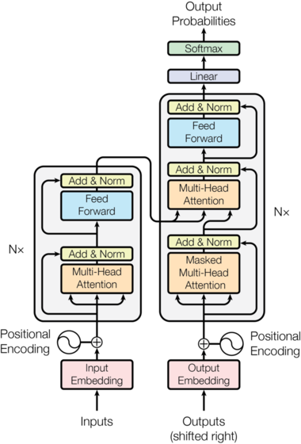
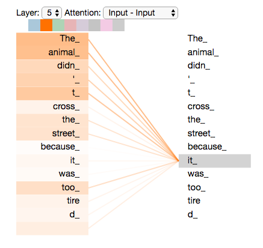

# Machine Translation French to English: 
#### **Implementation of idea proposed in 'Attention Is All You Need' paper**

- [Machine Translation French to English:](#machine-translation-french-to-english)
  - [Demo](#demo)
  - [What's in this repo?](#whats-in-this-repo)
  - [Transformer Background](#transformer-background)
    - [Transform Theory](#transform-theory)
- [Implementation using BERT Architecture](#implementation-using-bert-architecture)
  - [Dataset](#dataset)
  - [Training (Fastai)](#training-fastai)
    - [Finding suitable learning rate](#finding-suitable-learning-rate)
    - [Fit through epochs:](#fit-through-epochs)
  - [Technologies used](#technologies-used)
  - [Credits:](#credits)
  - [Creator](#creator)

## Demo


<p align="center"><i>Demo of working App developed using Streamlit</i></p>

## What's in this repo?
* [Fr2En_MachineTranslation_final.ipynb](Fr2En_MachineTranslation_final.ipynb) - Notebook with all the preprocessing, data prepartion, and model building training steps.
* [transformer/model.py](transformer/model.py) - Pytorch implementation of BERT model architecture.
* [modules/callbacks.py](modules/callbacks.py) - Fastai Callback utilities of loss and validation metric functions. 
* [WebApp](WebApp) - This directory contains model deployment setup files. 

## Transformer Background
#### Why not use Recurrent neural network (RNN)?
#### RNN based translation

A basic **Seq2seq** model consists of an encoder and decoder. The model takes input sentence with T tokens into the encoder and encodes information one word at a time and outputs a hidden state at every step that stores the sentence context till that point and passed on for encoding the next word. So the final hidden state (E[T]) at the end of the sentence stores the context of the entire sentence.
This final hidden state becomes the input for a decoder that produces translated sentence word by word. At each step, the decoder outputs a word and a hidden state(D[t]) which will be used for generating the next word.


 
 But traditional RNN suffers from the problem of vanishing gradients, making it ineffective for learning the context for long sequences.

#### RNN based translation with Attention
RNN model with **Attention** differs in the following things:

* Instead of the last hidden state, all the states (E[0], E[1]…, E[T]) at every step along with the final context vector (E[T]) are passed into the decoder. The idea here is each hidden state is majorly associated with a certain word in the input sentence. using all the hidden state gives a better translation.

* At every time step in the Decoding phase, scores are computed for every hidden state (E[t]) that stores how relevant is a particular hidden state in predicting a word at the current step(t). In this way,  more importance is given to the hidden state that is relevant in predicting the current word.

ex: when predicting the 5th word more importance must be given to the 4th, 5th, or 6th input hidden states (depends on the language structure to be translated).


This method is a significant improvement over traditional RNN. But RNNs lack a parallelization capability (RNN have wait till completion of t-1 steps to process at 't'th step) which makes it computationally efficient especially when dealing with a huge corpus of text.

### Transform Theory


The architecture looks complicated, but do not worry because it's not. It is just different from the previous ones. It can be parallelized, unlike Attention And/or RNN as it doesn't wait till all previous words are processed or encoded in the context vector.

#### Positional Encoding

- The Transformer architecture does not process data sequentially. So, This layer is used to incorporate relative position information of words in the sentence.


#### Attention Unit
In the transformer, there is no such concept as a hidden state. The transformer uses something called **Self-attention** that captures the association of a certain word with other words in the input sentence.




To explain in simple words, In the figure above the word 'it' associated with the word 'The' and 'animal' more than other words because the model has learned that 'it' is referred to 'animal' in this context. It is easy for us to tell this because we know 'street' won't get tired (as it doesn't move). But for the transformer, someone has to tell to put more focus on the word 'animal'. Self-attention does that.

OK, How it does that?

This is achieved by three vectors Query, Key, and Value which are obtained by multiplying input **word embedding** with the unknown weight matrices Wq, Wk, Wv (to be estimated)


Wq, Wk, Wv is parameter matrices to be learned to get q, k, and v upon multiplying with input embeddings


T - dimension of the key

After computing,  attention scores would look like this


Here the **Score** column is the result of the dot product of query and key. So, another way of interpreting this is a query word looking for similar words (not strictly though as query and key are not the same). Therefore words with high scores have a high association. Softmax pushes scores value between 0 and 1 (think as weights). So, the final column is the result of the weighted average of value vectors. We can see how attention screens out nonrelevant inputs for encoding each word.

If you notice computations are independent of each other, hence they can be parallelized.

Till now we have seen single head attention. we can also use multiple sets of q, k, v for each word for computing individual Attention scores providing greater flexibility in understanding context, and Finally resulting matrices are concatenated as shown below. This is called **Multi-head attention**.


Attention Scores (vectors) are feed into a feed-forward network with weight matrices (Wo) to bring attention output the same dimension as the input embedding.

**Note**: As we pass input embedding through many layers positional information may be decay. To make up for this we add the input matrix to attention output (add & norm) to retain position-related information.

The final output from the encoder unit is a dimension as an input encoder. These units can be stacked in series which makes the model robust. Finally, the output from the last encoder unit becomes the input for the decoder.

#### Decoder
similarly, multiple decoders can be stacked in a series where the first decoder uses the output of the final encoder. The last decoder outputs prediction translated words


The encoder component needs to look at each word in the input sentence to understand the context but while decoding, let say predicting 'i'th, it should be only be allowed to look at previous i-1 words. To prevent this, Inputs to the decoder are passed through the Masked **Multi-head Attention** that prevents future words to be part of the attention.

The decoder has to relay on Encoder input for the understanding context of the complete sentence. It is achieved by allowing the decoder to query the encoded embeddings (key and value) that stores both positional and contextual information. Since the query changes at every step, so does Attention telling which words to focus on input words to predict the current word.


Outputs are passed through fully connected layers the same as the encoder. Finally, the Linear layer expands the output dimension to vocabulary size (Linear), and softmax converts values to probabilities (between 0 and 1). word corresponding index of max probability will be output.


#### Intiuation behind using various components:

**Positional Encoding**: As the **Transformer** architecture does not have components to represent the sequential nature of the data. This layer is used to inject relative positions of the word in the sequence.

**Self-attention**: word embedding is broke down into *query*, *key*, and *value* of the same dimension. During the training phase, these matrices learn how much other words value it. *query* queries other words and get feedback as *key* which then dot produced with *value* to get the score. This is performed against all other words 

**Multi-Head Attention**: Multiple heads provided greater flexibility in understanding context as each one of it looks at the same input embedding in a different context (different Q, K, V) and brought to the same size as input embedding by concatenating. 


**Masked Self-Attention**: Encoder component needs to look at each word in the input sentence to understand the context but while decoding, let say predicting 'i'th,  it should be only be allowed to look at previous i-1 words, otherwise, it would be cheating. It is done by masking.

**Encoder-Decoder Attention**: Decoder has to relay on Encoder input for the understanding context of the complete sentence. It is achieved by allowing decoder query the encoded embeddings (*key* and *value*) that stores both positional and contextual information. Decoder predicts based on this embedding.

**Encoder-Decoder Stack**: One thing to notice in the **Transformer** network is the dimensions of the encoded embeddings (output of encoder) remains the same. In other words, it can be said that Encoded embedding is an improvised representation of original data. It can still be improved by stacking similar layer in sequence.


# Implementation using BERT Architecture

The Machine translation task has been implemented using [**BERT**](https://arxiv.org/abs/1810.04805) transformer architecture, which stands for **B**idirectional **E**ncoder **R**epresentations from **T**ransformers. BERT is designed to pre-train deep bidirectional representations from the unlabeled text by jointly conditioning on both left and right context in all layers. Hence, It is suitable for a wide range of tasks, such as question answering and language inference, without substantial task-specific architecture modifications.  

## Dataset 

Dataset consists of around 30000 pairs of french queries and their translation in English.  

**Sample of query pairs**
fr | en
---|---
Quelle sorte de poste aimeriez-vous occuper? | What sort of job would you like to be in?
What do adult attachment scales measure? | What do adult attachment scales measure?
Quel mécanisme utiliser pour mettre en œuvre cette protection (par exemple, les principes UDRP ou un autre mécanisme)? | What mechanism should be used to implement protection (for example, the UDRP or some other mechanism)?
Qu'arrive-t-il si les registres d'un organisme de bienfaisance ne sont pas satisfaisants? | What happens if a charity's records are inadequate?
À votre avis, pourquoi est-il important que les gouvernements gèrent les terres et les rivières? | What type of activities threaten the animals or plants in a national park?


**Model input Parametes**:

``` python
{'src_vocab_size': 22188,
 'tgt_vocab_size': 14236,
 'd_model': 300,
 'd_ff': 2048,
 'd_k': 64,
 'd_v': 64,
 'n_heads': 6,
 'n_layers': 6}
```

1. **src_vocab_size** - source language vocabulary size
2. **tgt_vocab_size** - target language vocabulary size
3. **d_model** - dimension of hidden units
4. **d_ff** - dimension of the decoder's feed-forward output
5. **d_k** - dimension of *key* vector 
6. **d_v** - dimension of *value* vector
7. **n_heads** - No of units in the Multihead attention
8. **n_layers** - No of layers in the Multi-Head attention units inside Encoder and decoder


## Training (Fastai)

### Finding suitable learning rate
* Selecting learning rate using ```lr_find```, a **fastai** utility.


```5e-4``` is the value chosen for learning rate

### Fit through epochs:

The model is trained using ```fit_one_cycle``` method which is the implementation of popular **one cycle policy** technique. 


<center><i><b> n_baches vs loss</b></i></center><br>


**Validation results**: 
epoch | train_loss | valid_loss | seq2seq_acc | bleu | time
------|------------|------------|-------------|------|-----
0 | 2.456067 | 2.653436 | 0.612640 | 0.433706 | 01:28
1 | 2.041358 | 2.261911 | 0.642574 | 0.462979 | 01:28
2 | 1.675195 | 1.926699 | 0.680742 | 0.488075 | 01:28
3 | 1.384582 | 1.713956 | 0.702641 | 0.511958 | 01:31
4 | 1.127888 | 1.588813 | 0.723198 | 0.536749 | 01:33
5 | 0.813250 | 1.529009 | 0.734520 | 0.553977 | 01:37
6 | 0.497641 | 1.541128 | 0.743082 | 0.570197 | 01:32
7 | 0.262595 | 1.580004 | 0.747232 | 0.581183 | 01:31
8 | 0.140268 | 1.620333 | 0.750187 | 0.587652 | 01:31
9 | 0.086930 | 1.639049 | 0.750771 | 0.589219 | 01:32


## Technologies used


[](https://pytorch.org/)
[]()
[](https://github.com/google-research/bert)
[](https://www.streamlit.io/)


</br>

## Credits:
1. [Attention Is All You Need - Paper (arxiv)](https://arxiv.org/abs/1706.03762)

2. [**harvardnlp** - The Annotated Transformer](http://nlp.seas.harvard.edu/2018/04/03/attention.html)
2. [Fastai - Introduction to Transformer](https://www.youtube.com/watch?v=KzfyftiH7R8&list=PLtmWHNX-gukKocXQOkQjuVxglSDYWsSh9&index=18)

3. [Transformer (Attention is all you need) - Minsuk Heo 허민석](https://www.youtube.com/watch?v=z1xs9jdZnuY&t=182s)

</br>

------
## Creator
<h2>Nitesh Kumar Shah</h2>